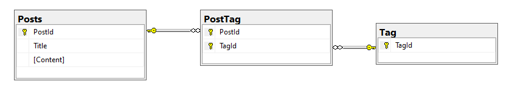
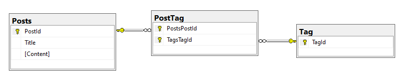

# Many-to-many Conventions

Her ses ER-diagrammet, når man benytter en Join Table:

Og her ses resultatet af den automatisk oprettede Join Table:

Læs mere her: [Many-to-many](https://learn.microsoft.com/en-us/ef/core/modeling/relationships/many-to-many)