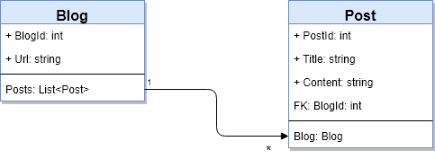

# OneToMany Convention

[Learn: Introduction to relationships](https://docs.microsoft.com/en-us/ef/core/modeling/relationships)

[Learn: One-to-many relationships](https://learn.microsoft.com/en-us/ef/core/modeling/relationships/one-to-many)

[Entity Framework Tutorial - One-to-Many](https://www.entityframeworktutorial.net/efcore/one-to-many-conventions-entity-framework-core.aspx)

