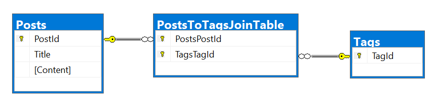

[Docs: One-to-many with Fluent API](https://docs.microsoft.com/en-us/ef/core/modeling/relationships#fluent-api)

[Learn: One-to-many relationships](https://learn.microsoft.com/en-us/ef/core/modeling/relationships/one-to-many)

